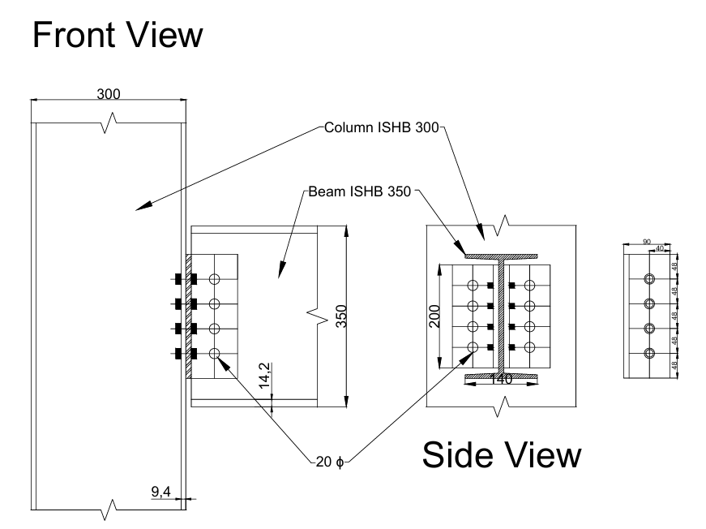
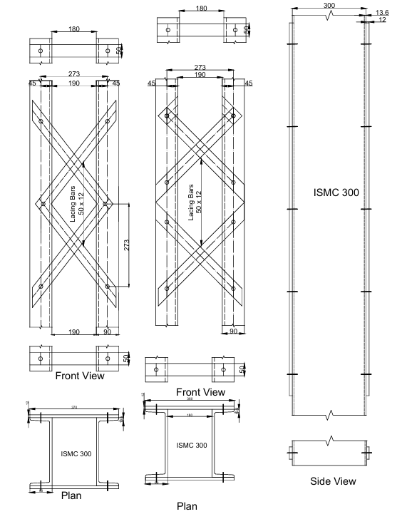
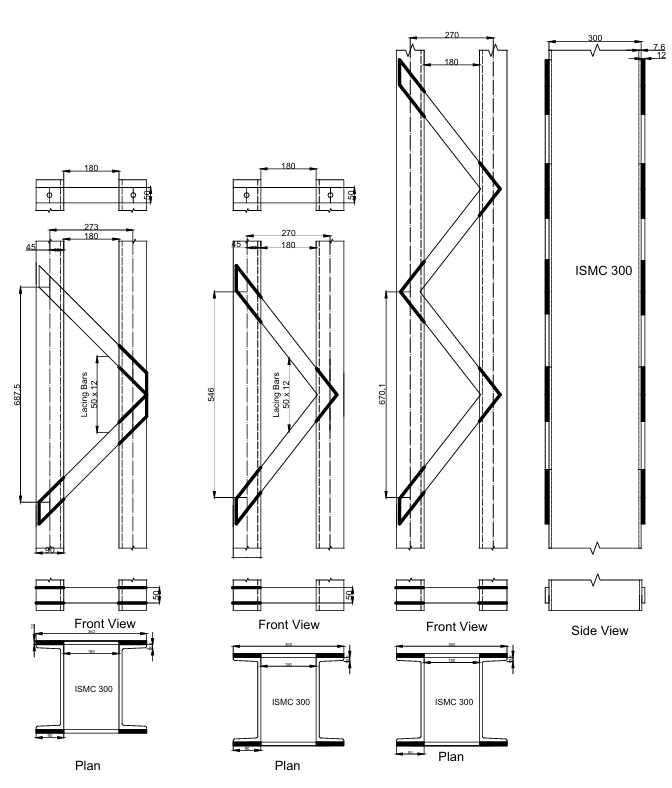
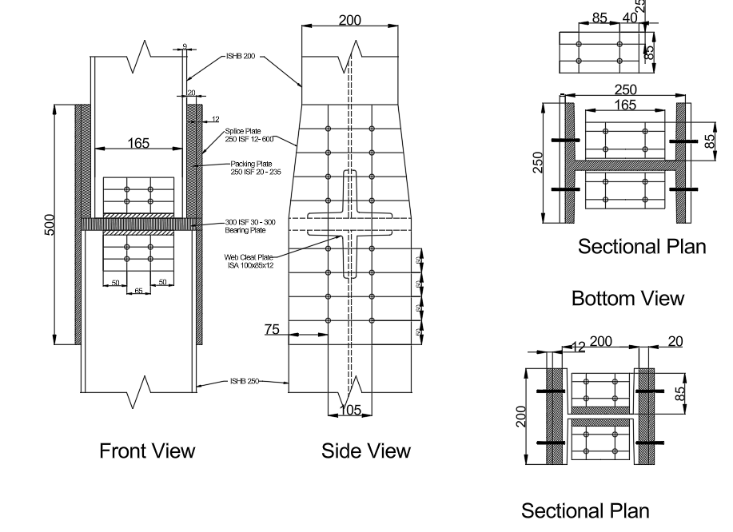
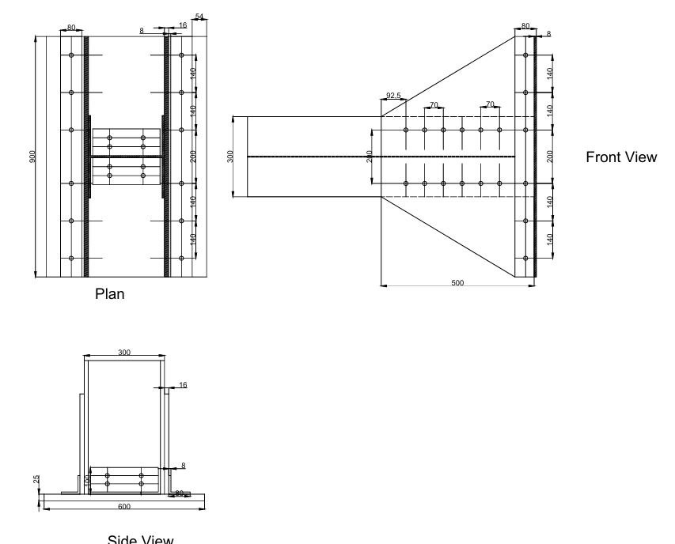

# AutoCAD Steel Connection Drawings

This repository contains a collection of AutoCAD drawings for various structural steel connections. These are useful for students, engineers, and drafters working on structural design and detailing.

## 📁 Contents

| Drawing Name | Description | Preview |
|--------------|-------------|---------|
| `Bolted Connection Beam To Beam.dwg` | Bolted connection between steel beams |  |
| `Column Batten.dwg` | Column with batten detailing |  |
| `Column Battern System C section Bolted.dwg` | Battened column using C-sections and bolts |  |
| `Column Battern System Face To Face.dwg` | Battened column with face-to-face configuration |  |
| `Column Beam Bolted Connection.dwg` | Column and beam bolted connection |  |
| `Column Beam Bolted connection Suing Seat Angle.dwg` | Bolted beam connection using seat angle |  |
| `Column Beam Welded Connection Using Seat Angle.dwg` | Welded beam connection using seat angle |  |
| `Column Double Lacing.dwg` | Column with double lacing members |  |
| `Column Single Alcing BAck to BAck.dwg` | Single laced columns back-to-back |  |
| `Column Single Lacing Weld.dwg` | Single lacing welded type |  |
| `Column Single Lacing.dwg` | Column with single lacing |  |
| `Column Splice With Bearing Plate BOX.dwg` | Column splice with box and bearing plate |  |
| `Column Splice With Bearing Plate.dwg` | Column splice using bearing plate |  |
| `Gusset Plates.dwg` | Gusset plate connection details |  |
| `Welded Beam To Beam.dwg` | Welded beam-to-beam connection |  |

## 📌 Usage

These `.dwg` drawings can be opened using:
- **AutoCAD**
- **Autodesk DWG TrueView** (Free viewer)
- Any compatible CAD software

